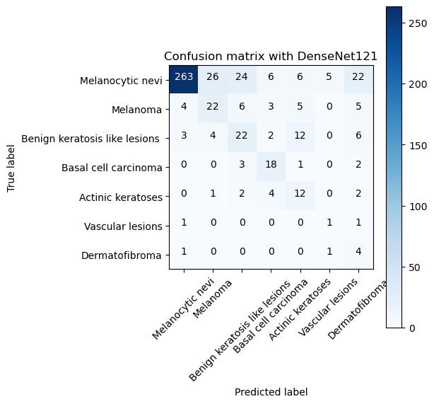
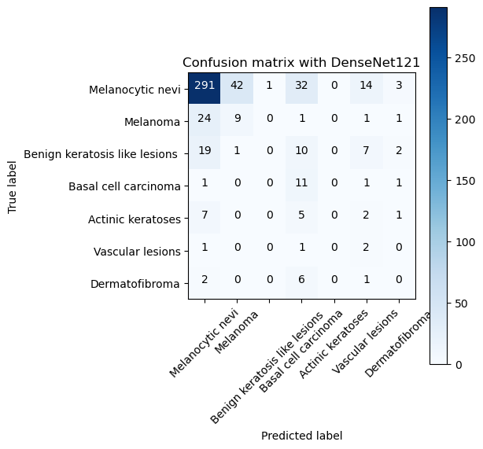
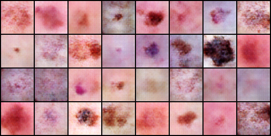
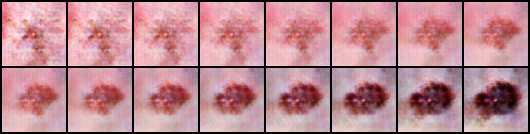
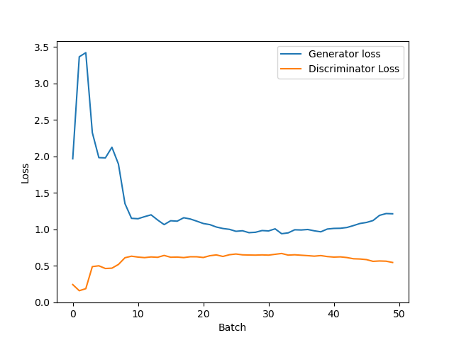

# Skin-Cancer-MNIST
Three notebooks were run two of them performed classification task one using DenseNet 121 and another using Gated Recurrent Network(LSTM gave horrible results) and another notebook was used to generate realistic images from the dataset using DCGAN(relatively runs on less GPUs) 
Due to GPU limitations only limited epochs were run, however it is clear from loss values that results would be better if more epochs were run.
## Classification Tasks
The Dataset for some lesions contained multiple images(with different levels of magnification), in which case only one image was taken thus reducing the dataset by roughly 20%. Augmentations were done like Flipping and Rotation to increase performance. 
Weighted Sampling was done on training dataset as there is drastic imbalance in labels of Dataset.
### DensetNet 121
Transfer Learning was used and last layer was modified to give the results.  
  
With roughly 70% accuracy on multiple runs
### Gated Recurrent Network
First LSTM was tried, but the results were too bad so switched to another RNN which gave good results, and it worked. 
This was obviously trained from scratched. With input size as columns and row and channel as the sequence length 
 
With roughly 65% accuracy on multiple runs
## Image Generation Task
DCGAN architecture was used with no augmentations like before and produced reasonably good images.  
 
Interpolation between two arbitrary images  
 
Generator and Discriminator Loss Curves 
 
